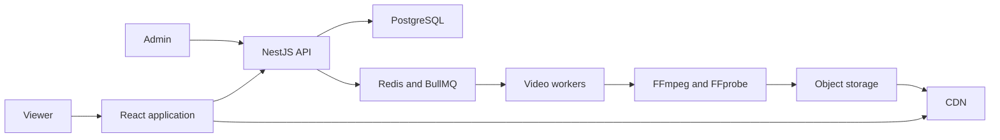

# TV Broadcast Architecture

## Playback model

TV Broadcast uses epoch-anchored pseudo-live playback.

Videos are processed ahead of time as HLS video-on-demand assets. Each channel has an ordered playlist that loops indefinitely and a shared playback epoch used as the cycle's time anchor.

When a viewer tunes in, the API uses authoritative server time to calculate a position within the repeating playlist:

```text
cycle duration = sum of playlist item durations
elapsed time = server time - playback epoch
cycle offset = positive modulo(elapsed time, cycle duration)
```

The API walks the ordered playlist to identify the video containing that cycle offset and its expected playback position. The client loads that video's HLS manifest, seeks to the expected position, and periodically corrects meaningful clock or playback drift.

The playback epoch is a mathematical phase reference, not a wall-clock premiere or activation time. Positive modulo keeps the playlist cyclic even for a time before the chosen anchor.

The initial product does not need program-specific air times, draft schedule versions, or future activation boundaries. The first synchronization vertical slice uses a static playlist. Playlist-edit transition behavior will be defined when the administrative workflow is implemented.

## System context



## Main components

- Web application: set-top-box interface and administrative screens.
- NestJS API using the default Express adapter: channels, playlists, assets, uploads, and current-program resolution.
- PostgreSQL: durable application, playlist, and playback-anchor data.
- Redis and BullMQ: asynchronous job delivery.
- Video workers: FFprobe and FFmpeg processing.
- Object storage: source files, thumbnails, HLS manifests, and segments.
- CDN: scalable media delivery in production.

## Initial pipeline

1. Accept a source upload.
2. Record the video asset.
3. Enqueue an inspection job.
4. Inspect source metadata.
5. Generate a thumbnail.
6. Transcode supported renditions.
7. Package HLS output.
8. Validate generated artifacts.
9. Publish the asset.
10. Mark the asset ready.

Every processing step must be safe to execute more than once.

## Core entities

- Channel
- VideoAsset
- VideoRendition
- Playlist
- PlaylistItem
- ProcessingJob
- ProcessingAttempt
- DeadLetterJob
