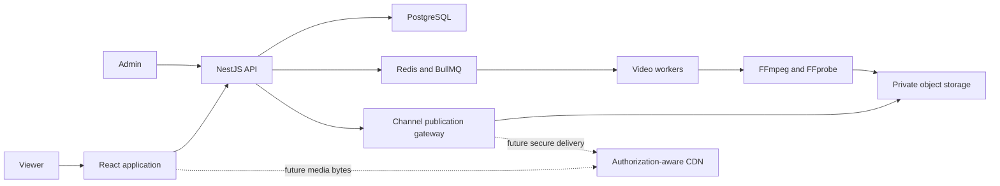

# TV Broadcast Architecture

## Playback model

TV Broadcast uses epoch-anchored, server-authoritative rolling live HLS.

Each channel has an ordered playlist of prerecorded assets and a shared playback epoch. The playlist loops indefinitely. The epoch is a mathematical phase reference, not a premiere or activation time.

The server uses authoritative time to calculate the channel's current position:

```text
cycle duration = sum of playlist item durations
elapsed time = server time - playback epoch
cycle offset = positive modulo(elapsed time, cycle duration)
```

That calculation remains the source of truth, but the browser no longer receives a complete asset manifest and an offset to seek to. Instead, the server maps the continuous channel timeline to monotonically increasing channel segment sequence numbers and publishes a bounded live window. A public channel's epoch is configured in the past so sequence zero and all viewer-visible HLS media-sequence values are nonnegative. The schedule resolver's pre-epoch behavior remains defined for cyclic calculations but is not serialized into a public live manifest.

For the first version, a segment becomes eligible for publication only after its scheduled interval has fully elapsed. This deliberately keeps the live edge at least one media segment behind the mathematical channel position, preventing a segment from exposing bytes assigned to a future interval. The window size is configurable; the initial fixture experiment exposes the six most recently completed segments, or approximately 12 seconds with the current two-second fixtures.

The live media playlist:

- is generated from authoritative server time when requested;
- contains only segment sequences currently inside the published rolling window;
- uses `#EXT-X-MEDIA-SEQUENCE` to identify the first channel sequence in the window;
- uses `#EXT-X-DISCONTINUITY` where required at asset boundaries;
- does not contain `#EXT-X-ENDLIST`;
- references channel-sequence URLs rather than private asset paths; and
- advances as newly eligible segments are published.

The browser loads one channel live manifest and lets hls.js or native HLS refresh it. Server publication, not a trusted browser seek, controls how far playback can advance. Client timing measurements may later support observability or bounded drift correction, but they are not an authorization mechanism or the source of the live position.

## Publication and access rules

Every manifest and segment request is evaluated against the same authoritative channel clock.

A channel segment request succeeds only when all of the following are true:

- the channel exists;
- the requested channel sequence maps to a valid playlist item and internal media segment;
- the segment's scheduled end is not later than authoritative server time; and
- the segment remains inside the configured rolling window.

Future, expired, unknown, and wrong-channel segment requests return `404`. Using the same response avoids exposing unnecessary information about private media or future programming.

Program and channel metadata may be public, but it does not grant media access. The current-program endpoint may support the interface, but it must not return private VOD manifests or internal storage paths.

## Media storage and delivery

FFmpeg preprocessing continues to create reusable HLS segments and validation manifests ahead of time. This is not real-time transcoding. Source uploads, renditions, complete VOD manifests, and raw asset segment paths are internal processing artifacts and private by default.

The initial secure slice sends live manifests and eligible segments through NestJS. The API translates a public channel sequence into a private artifact only after the publication check passes. Manifest and segment responses use `Cache-Control: no-store` initially so shared or browser caches cannot bypass rolling-window expiry.

Production may later move byte delivery to a CDN, but only with a separate accepted design that preserves these rules. Acceptable approaches include edge authorization on every request or narrowly scoped, short-lived signed capabilities whose lifetime cannot exceed the permitted access window. Object-storage origins remain private. A publicly readable bucket, stable origin URL, or guessable object key is not an authorization design.

The goal is to prevent access to future and expired broadcast media. Once bytes have legitimately reached a viewer, the viewer can record or copy them; preventing that would require DRM and is outside this project's scope.

## System context



## Main components

- Web application: set-top-box interface, live-channel player, and administrative screens.
- NestJS API using the default Express adapter: channels, playlists, metadata, uploads, live manifests, and publication-enforced segment delivery.
- Scheduling package: framework-independent looping-playlist and channel-segment timeline logic.
- Publication resolver: maps authoritative time and a channel sequence to the currently allowed rolling window.
- PostgreSQL: durable application, playlist, asset, and playback-anchor data.
- Redis and BullMQ: asynchronous job delivery.
- Video workers: FFprobe and FFmpeg processing.
- Private object storage: source files, thumbnails, renditions, validation manifests, and reusable HLS segments.
- Authorization-aware CDN: later scalable delivery that preserves publication and expiry rules.

## Local media delivery transition

The existing Phase 1 prototype serves generated fixtures under `/media` and exposes complete VOD manifests and raw segment paths. It proved that NestJS, Vite, hls.js, and the generated media work together, but it is not the final viewer architecture and currently violates the revised publication boundary.

The replacement viewer routes are:

```text
GET /api/channels/:channelId/live/index.m3u8
GET /api/channels/:channelId/live/segments/:sequence.ts
```

The unrestricted `/media` fixture route must be removed from the viewer path before the secure slice is complete. Generated fixture files remain ignored by Git and are recreated by `scripts/generate-hls-fixtures.sh`; their VOD manifests remain useful for FFmpeg validation and test setup only.

## Web playback boundary

The React `ChannelPlayer` owns loading, ready, and failure states. HLS operations remain isolated behind tested adapters that attach a manifest to a video element and return cleanup functions. The production browser adapter selects hls.js when Media Source Extensions are supported, falls back to native HLS, and reports an error when neither strategy is available.

These boundaries remain useful. The integration changes from loading a program VOD URL to loading a channel live URL. The player must not receive a future asset URL or calculate permission to seek forward. Pause and rewind behavior is naturally bounded by the media retained in the rolling playlist and player buffer.

## Build and package model

Private TypeScript workspace packages expose source entry points for reuse within the repository. Deployable applications bundle that source into their own runtime artifacts rather than requiring Node.js to execute TypeScript package entry points.

The NestJS API uses the Nest CLI with Webpack and `ts-loader`. Root type checking remains a separate `tsc --noEmit` step, and Vitest continues to use SWC. The API bundle is emitted at `apps/api/dist/main.js`. Its custom Webpack configuration ignores the unused optional `@fastify/static` import exposed by `@nestjs/serve-static`; the static-serving dependency can be removed after the unrestricted prototype media route is retired.

The React application uses Vite and emits production assets under `apps/web/dist/`. During development, Vite proxies `/api` to NestJS. The `/media` proxy exists only for the prototype and should be removed with the public static route.

This source-bundling approach applies to private internal packages. A package that later needs to be published or executed independently will require its own compiled JavaScript and declaration output.

## Initial pipeline

1. Accept a source upload into private storage.
2. Record the video asset.
3. Enqueue an inspection job.
4. Inspect source metadata.
5. Generate a thumbnail.
6. Transcode supported renditions.
7. Package reusable HLS segments and internal validation manifests.
8. Validate generated artifacts.
9. Publish the asset for administrative playlist use without making its media publicly readable.
10. Mark the asset ready.

Every processing step must be safe to execute more than once.

## Core entities

- Channel
- VideoAsset
- VideoRendition
- Playlist
- PlaylistItem
- ChannelSegment
- ProcessingJob
- ProcessingAttempt
- DeadLetterJob

## Security verification

The detailed threat model is maintained in `docs/SECURITY.md`. Security tests accompany each media-delivery milestone. At minimum they prove that:

- a live manifest contains only currently eligible channel sequences;
- the manifest has no VOD end marker or private asset path;
- the current rolling-window segment is retrievable;
- the next future segment is not retrievable, even by direct URL;
- a segment that has fallen out of the window is not retrievable;
- wrong-channel and unknown sequences are not retrievable;
- complete VOD manifests and raw asset segment paths are not reachable through the viewer API; and
- cache headers cannot extend access beyond the server's publication decision.
