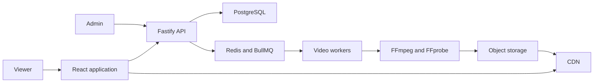

# TV Broadcast Architecture

## Playback model

TV Broadcast uses scheduled pseudo-live playback.

Videos are processed ahead of time as HLS video-on-demand assets. Each channel has an authoritative schedule based on server time. When a viewer tunes in, the API identifies the current program and calculates its expected playback position.

Expected playhead:

```text
server time - program start time
```

The client loads the program's HLS manifest and seeks to that position. It periodically checks for clock drift and corrects meaningful differences.

Published schedules are immutable. Editing a channel creates a draft schedule version that becomes active at a defined future boundary.

## System context



## Main components

- Web application: set-top-box interface and administrative screens.
- API: channels, schedules, assets, uploads, and current-program resolution.
- PostgreSQL: durable application and scheduling data.
- Redis and BullMQ: asynchronous job delivery.
- Video workers: FFprobe and FFmpeg processing.
- Object storage: source files, thumbnails, HLS manifests, and segments.
- CDN: scalable media delivery in production.

## Initial pipeline

1. Accept a source upload.
2. Record the video asset.
3. Enqueue an inspection job.
4. Inspect source metadata.
5. Generate a thumbnail.
6. Transcode supported renditions.
7. Package HLS output.
8. Validate generated artifacts.
9. Publish the asset.
10. Mark the asset ready.

Every processing step must be safe to execute more than once.

## Core entities

- Channel
- VideoAsset
- VideoRendition
- Playlist
- PlaylistItem
- ScheduleVersion
- ProgramSlot
- ProcessingJob
- ProcessingAttempt
- DeadLetterJob

