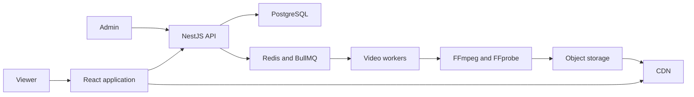

# TV Broadcast Architecture

## Playback model

TV Broadcast uses epoch-anchored pseudo-live playback.

Videos are processed ahead of time as HLS video-on-demand assets. Each channel has an ordered playlist that loops indefinitely and a shared playback epoch used as the cycle's time anchor.

When a viewer tunes in, the API uses authoritative server time to calculate a position within the repeating playlist:

```text
cycle duration = sum of playlist item durations
elapsed time = server time - playback epoch
cycle offset = positive modulo(elapsed time, cycle duration)
```

The API walks the ordered playlist to identify the video containing that cycle offset and its expected playback position. The current-program response includes authoritative server time, the resolved program and offset, and a manifest URL for that program. The client loads the HLS manifest, seeks to the expected position, and periodically corrects meaningful clock or playback drift.

The playback epoch is a mathematical phase reference, not a wall-clock premiere or activation time. Positive modulo keeps the playlist cyclic even for a time before the chosen anchor.

The initial product does not need program-specific air times, draft schedule versions, or future activation boundaries. The first synchronization vertical slice uses a static playlist. Playlist-edit transition behavior will be defined when the administrative workflow is implemented.

## System context



## Main components

- Web application: set-top-box interface and administrative screens.
- NestJS API using the default Express adapter: channels, playlists, assets, uploads, and current-program resolution.
- Scheduling package: framework-independent looping-playlist types and resolution logic shared by deployable applications.
- PostgreSQL: durable application, playlist, and playback-anchor data.
- Redis and BullMQ: asynchronous job delivery.
- Video workers: FFprobe and FFmpeg processing.
- Object storage: source files, thumbnails, HLS manifests, and segments.
- CDN: scalable media delivery in production.

## Local media delivery

During the Phase 1 synchronization slice, the NestJS API serves generated HLS fixtures from `fixtures/hls/` under the `/media` URL prefix. This keeps the first browser experiment same-origin and avoids introducing object storage before playback synchronization is understood.

The generated fixture files remain ignored by Git and are recreated by `scripts/generate-hls-fixtures.sh`. A clean checkout must run that generator before the media-delivery integration tests or local playback. Serving media through the API is a local-development adapter, not the production delivery architecture. Production manifests and segments will be stored in object storage and delivered through a CDN.

## Build and package model

Private TypeScript workspace packages expose source entry points for reuse within the repository. Deployable applications bundle that source into their own runtime artifacts rather than requiring Node.js to execute TypeScript package entry points.

The NestJS API uses the Nest CLI with Webpack and `ts-loader`. Root type checking remains a separate `tsc --noEmit` step, and Vitest continues to use SWC. The API bundle is emitted at `apps/api/dist/main.js`. Its custom Webpack configuration ignores the unused optional `@fastify/static` import exposed by `@nestjs/serve-static`; the API uses the Express adapter.

The React application uses Vite and emits its production assets under `apps/web/dist/`. During development, Vite proxies `/api` and `/media` to the NestJS API so browser code can use the same root-relative URLs that production routing will expose.

This source-bundling approach applies to private internal packages. A package that later needs to be published or executed independently will require its own compiled JavaScript and declaration output.

## Initial pipeline

1. Accept a source upload.
2. Record the video asset.
3. Enqueue an inspection job.
4. Inspect source metadata.
5. Generate a thumbnail.
6. Transcode supported renditions.
7. Package HLS output.
8. Validate generated artifacts.
9. Publish the asset.
10. Mark the asset ready.

Every processing step must be safe to execute more than once.

## Core entities

- Channel
- VideoAsset
- VideoRendition
- Playlist
- PlaylistItem
- ProcessingJob
- ProcessingAttempt
- DeadLetterJob
